# Flujo completo Front → Back del plugin DingConnect Recargas

## Propósito

Este documento describe el recorrido completo del plugin DingConnect Recargas desde la perspectiva del usuario final (frontend) con indicaciones de lo que ocurre en el backend (plugin WordPress, WooCommerce, API DingConnect) en cada paso. Sirve como mapa de ruta unificado para desarrollo, soporte y documentación.

---

## Diagrama Mermaid

```mermaid
flowchart TB
    %% ── ESTILOS ──
    classDef frontend fill:#e0f2fe,stroke:#0284c7,color:#0c4a6e
    classDef backend fill:#fef3c7,stroke:#d97706,color:#78350f
    classDef ding fill:#fce7f3,stroke:#db2777,color:#831843
    classDef admin fill:#dcfce7,stroke:#16a34a,color:#14532d
    classDef woo fill:#ede9fe,stroke:#7c3aed,color:#4c1d95
    classDef decision fill:#fff7ed,stroke:#ea580c,color:#7c2d12

    %% ════════════════════════════════════════════════════
    %% FASE 0: CONFIGURACIÓN INICIAL (ADMIN / BACKEND)
    %% ════════════════════════════════════════════════════

    subgraph F0["Fase 0 — Configuración inicial (Admin)"]
        direction TB
        A0[("Admin: Config")]:::admin
        A0 --> A1["Introducir API Key DingConnect"]:::admin
        A1 --> A1a["Backend: guarda en<br/>dc_recargas_options['api_key']"]:::backend
        A1a --> A2["Seleccionar modo de recarga:<br/>🔒 Pruebas / ⚙️ Híbrido / ⚡ Producción"]:::admin
        A2 --> A2a["Backend: dc_recargas_options<br/>validate_only / allow_real_recharge<br/>impactan SendTransfer"]:::backend
        A2a --> A3["Configurar pasarelas WooCommerce permitidas<br/>(opcional)"]:::admin
        A3 --> A3a["Backend: woo_allowed_gateways[]<br/>filtra métodos de pago en checkout"]:::backend
    end

    %% ════════════════════════════════════════════════════
    %% FASE 1: CATÁLOGO Y BUNDLES (ADMIN)
    %% ════════════════════════════════════════════════════

    subgraph F1["Fase 1 — Catálogo y alta de bundles (Admin)"]
        direction TB
        B0[("Admin: Catálogo y alta")]:::admin
        B0 --> B1["Buscar en API<br/>Seleccionar país + filtrar por tipo"]:::admin
        B1 --> B1a["Backend: GET /api/V1/GetProducts (DingConnect)<br/>normaliza Items → shape frontend"]:::ding
        B1a --> B2["Tabla Paquetes encontrados<br/>8 columnas: Tipo, Operador, Beneficios,<br/>SKU, Coste, Moneda, Vigencia, Fuente"]:::admin
        B2 --> B3["Doble click en paquete →<br/>Alta manual (modal precargado)"]:::admin
        B3 --> B3a["Backend: hidrata campos ocultos<br/>ProviderCode, Benefits, IsRange,<br/>SettingDefinitions, etc."]:::backend
        B3a --> B4["Ajustar Precio al Público<br/>(precio comercial)"]:::admin
        B4 --> B5["Guardar bundle →<br/>dc_recargas_bundles[]"]:::admin
        B5 --> B5a["Backend: persiste en option WP<br/>con precio dual (send_value + public_price)<br/>package_family, validity_raw, etc."]:::backend
    end

    %% ════════════════════════════════════════════════════
    %% FASE 2: LANDINGS Y SHORTCODES (ADMIN)
    %% ════════════════════════════════════════════════════

    subgraph F2["Fase 2 — Landings y shortcodes (Admin)"]
        direction TB
        C0[("Admin: Landings")]:::admin
        C0 --> C1["Crear landing: nombre, título, subtítulo"]:::admin
        C1 --> C1a["Backend: genera landing_key única"]:::backend
        C1a --> C2["Seleccionar bundles de la landing<br/>checklist con filtros por país y tipo<br/>drag & drop para ordenar"]:::admin
        C2 --> C2a["Backend: persiste bundle_ids ordenados,<br/>featured_bundle_id, country_iso derivado<br/>→ dc_recargas_landing_shortcodes[]"]:::backend
        C2a --> C3["Copiar shortcode generado:<br/>[dingconnect_recargas landing_key='...']"]:::admin
        C3 --> C3a["Backend: shortcode resuelve<br/>config landing + bundles en runtime"]:::backend
    end

    %% ════════════════════════════════════════════════════
    %% FASE 3: USUARIO FRONTEND — SELECCIÓN
    %% ════════════════════════════════════════════════════

    subgraph F3["Fase 3 — Usuario: selección de producto (Frontend)"]
        direction TB
        D0[("Frontend: shortcode público<br/>dingconnect_recargas")]:::frontend
        D0 --> D1["Paso 1: Elegir país<br/>(overlay con búsqueda)"]:::frontend
        D1 --> D1a["Frontend: filtra países<br/>disponibles en la landing"]:::frontend
        D1a --> D2["Paso 2: Ingresar número móvil<br/>(auto-detección de país por prefijo)"]:::frontend
        D2 --> D2a["Frontend: normalizePhone()<br/>→ +{dial}{local}"]:::frontend
        D2a --> D3["Búsqueda automática de paquetes<br/>(debounce 500ms)"]:::frontend
        D3 --> D3a["GET /wp-json/dingconnect/v1/products<br/>?account_number=...&country_iso=...<br/>&allowed_bundle_ids=..."]:::backend
        D3a --> D3b{"Backend: ¿bundles guardados<br/>para esta landing?"}:::decision
        D3b -- "Sí (source=saved)" --> D3c["Devuelve bundles desde<br/>dc_recargas_bundles[]<br/>con precio comercial"]:::backend
        D3b -- "No (source=dingconnect)" --> D3d["Consulta GetProducts live<br/>a DingConnect API<br/>enriquece con GetProviders"]:::ding
        D3d --> D3e["Normaliza productos:<br/>ProviderName, ReceiveValue,<br/>IsRange, SettingDefinitions,<br/>ValidationRegex, etc."]:::backend
        D3c --> D4
        D3e --> D4
        D4["Paso 3: Seleccionar paquete<br/>(select con ficha de detalle)"]:::frontend
        D4 --> D4a["Frontend: renderPackageCard()<br/>— Beneficios recibidos<br/>— Operador<br/>— Precio al público<br/>— País ISO"]:::frontend
        D4a --> D4b{"¿Producto de rango?"}:::decision
        D4b -- "Sí" --> D4c["Input de importe +<br/>POST /estimate-prices<br/>→ estimación de recibe"]:::frontend
        D4b -- "No" --> D4d{"¿Requiere LookupBills?"}:::decision
        D4d -- "Sí" --> D4e["Botón Consultar factura<br/>→ POST /lookup-bills<br/>→ seleccionar factura"]:::frontend
        D4d -- "No" --> D4f{"¿Tiene SettingDefinitions?"}:::decision
        D4f -- "Sí" --> D4g["Inputs dinámicos requeridos<br/>por el proveedor"]:::frontend
        D4f -- "No" --> D4h["Datos estáticos del paquete<br/>listos para confirmar"]:::frontend
        D4c --> D4h
        D4e --> D4h
        D4g --> D4h
        D4h --> D4i["Frontend: ensureProviderStatus()<br/>GET /provider-status<br/>(bloquea si proveedor caído)"]:::frontend
        D4i --> D4j["Frontend: validateSelectedBundle()<br/>— ValidationRegex contra número<br/>— Settings obligatorios<br/>— Rango de importe<br/>— BillRef requerido"]:::frontend
    end

    %% ════════════════════════════════════════════════════
    %% FASE 4: USUARIO FRONTEND — CONFIRMACIÓN
    %% ════════════════════════════════════════════════════

    subgraph F4["Fase 4 — Usuario: confirmación (Frontend)"]
        direction TB
        E0["Paso 4: Confirmar pedido<br/>buildConfirmStep()"]:::frontend
        E0 --> E1["Resumen visual:<br/>— País, número, operador<br/>— Paquete + beneficios<br/>— Importe + recibe estimado<br/>— Factura (si aplica)<br/>— Settings dinámicos<br/>— Teléfono de soporte"]:::frontend
        E1 --> E2{"¿WooCommerce activo?"}:::decision
        E2 -- "Sí" --> E3["Botón: Proceder al pago"]:::frontend
        E2 -- "No" --> E4["Botón: Confirmar recarga"]:::frontend
    end

    %% ════════════════════════════════════════════════════
    %% FASE 5: CHECKOUT Y PAGO (WOOCOMMERCE)
    %% ════════════════════════════════════════════════════

    subgraph F5["Fase 5 — Checkout y pago (WooCommerce)"]
        direction TB
        E3 --> F0a["POST /add-to-cart<br/>payload completo:<br/>account_number, sku_code, send_value,<br/>public_price, settings[], bill_ref,<br/>product_type, redemption_mechanism, etc."]:::frontend
        F0a --> F0b["Backend: handle_add_to_cart()<br/>— Crea/usa producto virtual base<br/>— Guarda metadatos en cart item<br/>(dc_account_number, dc_settings, etc.)"]:::woo
        F0b --> F0c["Redirige a /checkout"]:::backend
        F0c --> F1a["Checkout WooCommerce"]:::frontend
        F1a --> F1b{"¿Solo recargas DingConnect<br/>en carrito?"}:::decision
        F1b -- "Sí" --> F1c["Checkout minimalista:<br/>— Solo nombre, email, teléfono<br/>— Sin dirección/envío<br/>— Sin registro obligatorio<br/>— Filtra pasarelas permitidas<br/>— Oculta créditos tienda (opcional)"]:::frontend
        F1b -- "No" --> F1d["Checkout completo WooCommerce<br/>+ registro obligatorio"]:::frontend
        F1c --> F1e["Usuario ingresa datos básicos:<br/>— Nombre<br/>— Email<br/>— Teléfono"]:::frontend
        F1d --> F1e
        F1e --> F1f["Seleccionar método de pago"]:::frontend
        F1f --> F1g["Realizar pedido (pago)"]:::frontend
        F1g --> F1h{"Pasarela ejecuta pago"}:::decision
        F1h -- "Éxito" --> F1i["order → processing/completed"]:::woo
        F1h -- "Fallo" --> F1j["order → failed<br/>Mensaje de error al usuario"]:::woo
    end

    %% ════════════════════════════════════════════════════
    %% FASE 6: DESPACHO POST-PAGO (BACKEND WOOCOMMERCE)
    %% ════════════════════════════════════════════════════

    subgraph F6["Fase 6 — Despacho post-pago (Backend WooCommerce)"]
        direction TB
        F1i --> G0a["Hook: handle_payment_complete()<br/>handle_order_status_processing()<br/>handle_order_status_completed()"]:::woo
        G0a --> G0b["Filtro: ¿este hook coincide<br/>con la etapa configurada<br/>para esta pasarela?"]:::decision
        G0b -- "No" --> G0c["Salta (skipped)"]:::woo
        G0b -- "Sí" --> G0d["process_recarga_on_payment()"]:::woo
        G0d --> G0e{"¿order->is_paid()?"}:::decision
        G0e -- "No" --> G0f["Nota: orden no pagada → sale"]:::woo
        G0e -- "Sí" --> G1["Por cada item dc_recarga en la orden:"]:::woo
        G1 --> G1a["Validar bundle contra catálogo guardado<br/>(validate_send_value_from_item())"]:::woo
        G1a --> G1b["Sincronizar con DingConnect<br/>ListTransferRecords<br/>— ¿Ya está confirmado? → skip<br/>— ¿Sigue Submitted? → programar retry<br/>— ¿Error definitivo? → marcar fail"]:::ding
        G1b --> G2["Si no está resuelto:<br/>attempt_transfer_for_item()"]:::woo
        G2 --> G2a["Normalizar monto fijo (si aplica)"]:::woo
        G2a --> G2b["Verificar pasarela permitida<br/>(blocked_gateway si no coincide)"]:::woo
        G2b --> G2c{"¿Gateways OK?"}:::decision
        G2c -- "No" --> G2d["Marca blocked_gateway<br/>cancela reintentos<br/>nota en pedido"]:::woo
        G2c -- "Sí" --> G2e["POST SendTransfer (DingConnect)<br/>con DistributorRef, Settings, BillRef<br/>ValidateOnly = false (producción)"]:::ding
        G2e --> G3{"Respuesta DingConnect"}:::decision
        G3 -- "Complete + TransferRef válido" --> G3a["Éxito: marca transfer_status OK<br/>guarda TransferRef, ReceiptText<br/>nota en pedido"]:::woo
        G3 -- "Complete sin TransferRef" --> G3b["pending_confirmation<br/>requiere ListTransferRecords"]:::woo
        G3 -- "Submitted/Pending" --> G3c["Programa reintento<br/>(backoff configurable)"]:::woo
        G3 -- "ProviderError" --> G3d["Marca error con contexto<br/>(ding_error_context)"]:::woo
        G3 -- "InsufficientBalance /<br/>AccountNumberInvalid /<br/>RateLimited" --> G3e["Error definitivo o reintentable<br/>según política configurada"]:::woo
        G3c --> G3f["Política de reintentos:<br/>— submitted_retry_max_attempts<br/>— backoff_minutes<br/>— max_window_hours<br/>— escalation_email"]:::woo
        G3f --> G3g{"¿Superó intentos<br/>o ventana?"}:::decision
        G3g -- "No" --> G3c
        G3g -- "Sí" --> G3h["Escalado a soporte<br/>marca escalado_soporte<br/>notifica por email"]:::woo
    end

    %% ════════════════════════════════════════════════════
    %% FASE 7: RESULTADO Y VOUCHER
    %% ════════════════════════════════════════════════════

    subgraph F7["Fase 7 — Resultado y voucher (Frontend + Backend)"]
        direction TB
        G3a --> H0["Paso 5: Pantalla de resultado"]:::frontend
        H0 --> H1["WooCommerce thank-you:<br/>Resumen final de recarga<br/>(modal + Guardar PDF en A6)"]:::frontend
        H1 --> H2["Según tipo de producto:"]:::frontend
        H2 --> H2a["📱 Móvil estándar:<br/>Recarga procesada<br/>ID de transacción"]:::frontend
        H2 --> H2b["🔢 Móvil rango:<br/>Importe final confirmado<br/>con estimación aplicada"]:::frontend
        H2 --> H2c["🎫 PIN/Voucher:<br/>Código PIN mostrado<br/>Instrucciones de canje<br/>ReceiptText"]:::frontend
        H2 --> H2d["💡 Electricidad:<br/>Pago de servicio registrado<br/>Ref: BillRef<br/>Comprobante"]:::frontend
        H2 --> H2e["📡 DTH:<br/>Recarga TV registrada<br/>ID de transacción"]:::frontend
        H2 --> H3["Email WooCommerce:<br/>— Resumen de recarga<br/>— Próximos pasos si hay<br/>pendientes o errores"]:::backend
        H3 --> H4{"¿Estado pendiente<br/>(Submitted)?"}:::decision
        H4 -- "Sí" --> H5["⚠️ Mensaje:<br/>No repitas la compra.<br/>Seguimos conciliando."]:::frontend
        H4 -- "No" --> H6["✅ Mensaje de éxito<br/>Conserva el ID de transacción<br/>para soporte"]:::frontend
        G3c --> H4
        G3h --> H7["⚠️ Pedido con recargas<br/>pendientes de soporte<br/>Se notificará por email"]:::frontend
    end

    %% ════════════════════════════════════════════════════
    %% FASE 8: MODO DIRECTO (SIN WOOCOMMERCE)
    %% ════════════════════════════════════════════════════

    subgraph F8["Fase 7b — Modo directo (sin WooCommerce)"]
        direction TB
        E4 --> I0["POST /wp-json/dingconnect/v1/transfer"]:::frontend
        I0 --> I1["Backend: ¿Modo WooCommerce activo?"]:::decision
        I1 -- "Sí" --> I1a["403 Forbidden<br/>forzando add-to-cart"]:::backend
        I1 -- "No" --> I2["Backend: send_transfer()<br/>DistributorRef, AccountNumber,<br/>SkuCode, SendValue, Settings, BillRef"]:::backend
        I2 --> I3["DingConnect SendTransfer<br/>(ValidateOnly según config)"]:::ding
        I3 --> I4["Frontend: showFriendlyResult()"]:::frontend
        I4 --> I5["Pantalla resultado:<br/>— Éxito / Pendiente / Error<br/>— Según flowKind:<br/>voucher / electricity / dth / range / mobile<br/>— ReceiptText, PIN, providerRef<br/>— Próximos pasos"]:::frontend
    end

    %% ════════════════════════════════════════════════════
    %% CONEXIONES ENTRE FASES
    %% ════════════════════════════════════════════════════

    F0 --> F1
    F1 --> F2
    F2 --> F3
    F3 --> F4
    F4 --> F5
    F4 --> F8
    F5 --> F6
    F6 --> F7
```



---

## Descripción del flujo por fases

### Fase 0 — Configuración inicial (Admin)

| Paso | Frontend (Admin) | Backend (Plugin) |
|------|-----------------|------------------|
| 0.1 | Panel Config → introducir **API Key DingConnect** | Se guarda en `dc_recargas_options['api_key']` |
| 0.2 | Seleccionar **Modo de recargas**: Pruebas / Híbrido / Producción | Configura `validate_only` y `allow_real_recharge` que afectan directamente a `SendTransfer` |
| 0.3 | Opcional: seleccionar **pasarelas WooCommerce permitidas** | Se guarda en `woo_allowed_gateways[]` para filtrar métodos de pago en checkout |

### Fase 1 — Catálogo y alta de bundles (Admin)

| Paso | Frontend (Admin) | Backend (Plugin) |
|------|-----------------|------------------|
| 1.1 | Pestaña Catálogo → **Buscar en API** → seleccionar país + filtro tipo | `GET /api/V1/GetProducts` a DingConnect; normaliza Items → shape admin |
| 1.2 | **Tabla Paquetes encontrados**: Tipo, Operador, Beneficios, SKU, Coste, Moneda, Vigencia | Datos crudos de DingConnect con heurística de agrupación (`package_group`) |
| 1.3 | **Doble click** en paquete → modal Alta manual precargado | Hidrata campos internos: `provider_code`, `benefits[]`, `is_range`, `setting_definitions` |
| 1.4 | Ajustar **Precio al Público** (precio comercial) | Se integra al bundle como `public_price` junto con `send_value` (coste DIN) |
| 1.5 | Guardar bundle | Persiste en `dc_recargas_bundles[]` (option WP) con precio dual, `package_family`, `validity_raw` |

### Fase 2 — Landings y shortcodes (Admin)

| Paso | Frontend (Admin) | Backend (Plugin) |
|------|-----------------|------------------|
| 2.1 | Pestaña Landings → **Crear landing**: nombre, título, subtítulo | Genera `landing_key` única automática |
| 2.2 | **Seleccionar bundles** del checklist con filtros, drag & drop para ordenar, marcar destacado | Guarda `bundle_ids` ordenados, `featured_bundle_id`, país derivado → `dc_recargas_landing_shortcodes[]` |
| 2.3 | **Copiar shortcode** generado: `[dingconnect_recargas landing_key="..."]` | Backend resuelve la configuración en runtime cuando se renderiza el shortcode |

### Fase 3 — Usuario: selección de producto (Frontend)

| Paso | Frontend (Usuario) | Backend (Plugin) |
|------|-------------------|------------------|
| 3.1 | **Elegir país** desde overlay con búsqueda | — |
| 3.2 | **Ingresar número móvil** (auto-detección de país por prefijo) | — |
| 3.3 | **Búsqueda automática** de paquetes (debounce 500ms) | `GET /products?account_number=...&country_iso=...&allowed_bundle_ids=...` |
| 3.4 | **Seleccionar paquete** del desplegable → ficha detalle | Devuelve bundles guardados (`source=saved`) o live API (`source=dingconnect`) |
| 3.5 | Si es **producto de rango**: input de importe + estimación | `POST /estimate-prices` a DingConnect |
| 3.6 | Si requiere **LookupBills**: botón consultar factura | `POST /lookup-bills` a DingConnect |
| 3.7 | Si tiene **SettingDefinitions**: inputs dinámicos | Se reenvían como `settings[{Name, Value}]` |
| 3.8 | **Validación** del bundle (ValidationRegex, settings obligatorios, rango) | `GET /provider-status` para verificar disponibilidad del proveedor |

### Fase 4 — Usuario: confirmación (Frontend)

| Paso | Frontend (Usuario) | Backend |
|------|-------------------|---------|
| 4.1 | **Resumen visual**: país, número, operador, paquete, beneficios, importe, recibe estimado, factura, settings, soporte | — |
| 4.2 | Botón **"Proceder al pago"** (WooCommerce) o **"Confirmar recarga"** (directo) | Decide ruta según `payment_mode` |

### Fase 5 — Checkout y pago (WooCommerce)

| Paso | Frontend (Usuario) | Backend (Plugin/WooCommerce) |
|------|-------------------|------------------------------|
| 5.1 | Click en "Proceder al pago" | `POST /add-to-cart` con payload completo; crea producto virtual; guarda metadatos en carrito |
| 5.2 | **Redirige a checkout** | — |
| 5.3 | Checkout **minimalista** (solo recargas): nombre, email, teléfono. Sin dirección. | Filtra pasarelas; oculta créditos tienda opcional |
| 5.4 | Usuario ingresa **datos básicos** y selecciona **método de pago** | — |
| 5.5 | **Realizar pedido** | WooCommerce procesa pago según pasarela |
| 5.6 | Pago exitoso → orden pasa a `processing` o `completed` | — |
| 5.7 | Pago fallido → orden `failed` + mensaje error | — |

### Fase 6 — Despacho post-pago (Backend WooCommerce)

| Paso | Backend | API DingConnect |
|------|---------|-----------------|
| 6.1 | `handle_payment_complete()` detecta pago | — |
| 6.2 | Filtra por **etapa configurada para la pasarela** (`payment_complete` / `processing` / `completed`) | — |
| 6.3 | Verifica `order->is_paid()` | — |
| 6.4 | Por cada ítem `dc_recarga`: **sincroniza con Ding** | `ListTransferRecords` para evitar duplicados |
| 6.5 | Si no resuelto: valida bundle, normaliza monto fijo, verifica pasarela permitida | — |
| 6.6 | **Envía** `SendTransfer` con todos los datos | `POST SendTransfer` con `DistributorRef`, `Settings`, `BillRef` |
| 6.7 | Procesa respuesta: éxito / pending / error | — |
| 6.8 | Si `Submitted`: programa **reintentos** con backoff configurable | — |
| 6.9 | Si supera intentos: **escala a soporte** por email | — |
| 6.10 | Sincroniza **estado del pedido** según resultado agregado | — |

### Fase 7 — Resultado y voucher (Frontend + Backend)

| Paso | Frontend (Usuario) | Backend |
|------|-------------------|---------|
| 7.1 | Pantalla **thank-you** con resumen de recarga | WooCommerce renderiza datos de cada item |
| 7.2 | **Según tipo de producto**:<br/>📱 Móvil → recarga procesada<br/>🔢 Rango → importe confirmado<br/>🎫 PIN → código + instrucciones<br/>💡 Electricidad → comprobante<br/>📡 DTH → recarga registrada | Inyecta `ReceiptText`, `TransferRef`, `PIN`, `BillRef` desde metadatos |
| 7.3 | Si hay **pendientes**: mensaje "No repitas la compra" | Estado `pending_retry` o `escalado_soporte` |
| 7.4 | **Email WooCommerce** con resumen y próximos pasos | Inyecta metadatos en `woocommerce_email_order_meta_fields` |
| 7.5 | Admin puede **reintentar manualmente** desde acciones del pedido | Botón "Reintentar recargas DingConnect" |

### Fase 7b — Modo directo (sin WooCommerce)

| Paso | Frontend (Usuario) | Backend (Plugin) |
|------|-------------------|------------------|
| 7b.1 | Click en "Confirmar recarga" | `POST /transfer` (si `payment_mode=woocommerce` responde 403) |
| 7b.2 | — | `send_transfer()` con `ValidateOnly` según modo configurado |
| 7b.3 | — | Log en `dc_transfer_log` (CPT) |
| 7b.4 | **Pantalla resultado** con copy adaptado por familia de producto | Normaliza respuesta: éxito/pendiente/error + `ReceiptText` + `TransferRef` |

---

## Resumen de endpoints REST del plugin involucrados

| Endpoint | Método | Uso | Fase |
|----------|--------|-----|------|
| `/wp-json/dingconnect/v1/status` | GET | Estado configuración | 0 |
| `/wp-json/dingconnect/v1/balance` | GET | Consultar saldo (admin) | 0 |
| `/wp-json/dingconnect/v1/products` | GET | Catálogo de productos por país/número | 3 |
| `/wp-json/dingconnect/v1/provider-status` | GET | Estado del proveedor | 3 |
| `/wp-json/dingconnect/v1/estimate-prices` | POST | Estimar recibe para productos de rango | 3 |
| `/wp-json/dingconnect/v1/lookup-bills` | POST | Consultar facturas | 3 |
| `/wp-json/dingconnect/v1/landing-config` | GET | Config runtime de la landing | 3 |
| `/wp-json/dingconnect/v1/transfer` | POST | Recarga directa (sin WooCommerce) | 7b |
| `/wp-json/dingconnect/v1/add-to-cart` | POST | Añadir al carrito WooCommerce | 5 |
| `/wp-json/dingconnect/v1/transfer-status` | POST | Consultar estado de transferencia | 6 |
| `/wp-json/dingconnect/v1/webhook` | POST | Webhook DingConnect (Deferred) | 6 |

---

## Configuraciones clave que afectan el flujo

| Opción | Dónde se configura | Impacto |
|--------|-------------------|---------|
| `api_key` | Config → API Key DingConnect | Autenticación contra API DingConnect |
| `payment_mode` | Config → Modo de recargas | `direct` = recarga directa; `woocommerce` = obliga carrito + checkout |
| `validate_only` / `allow_real_recharge` | Config → Modo Pruebas/Producción | Controla si `SendTransfer` ejecuta o solo valida |
| `woo_allowed_gateways[]` | Config → Pasarelas permitidas | Filtra métodos de pago en checkout para carritos con recargas |
| `submitted_retry_*` | Config → Reintentos | Política de reintentos para estados `Submitted` |
| `submitted_non_retryable_codes` | Config → Códigos no reintentables | Errores que cortan reintentos inmediatamente |
| `submitted_escalation_email` | Config → Correo de escalado | Notificación cuando se supera ventana de reintentos |
| `manual_amount_mode` | Config → Monto manual | `range_products` = solo rango editable; `all` = todos editable |
| `wizard_enabled` | Config (Wizard) | Habilita el wizard v2 para landings externas |

---

## Política de reintentos (Submitted prolongado)

```
Intento 1:  espera 10 min
Intento 2:  espera 20 min
Intento 3:  espera 40 min
Intento 4:  espera 80 min
...
Escalado:   a las 12h → email a soporte
```

Los reintentos se programan con `wp_schedule_single_event()` y se ejecutan desde `dc_recargas_retry_transfer`.

---

## Notas importantes

1. **Modo WooCommerce**: si está activo, el endpoint `/transfer` devuelve `403` para forzar el flujo `add-to-cart → checkout → pago → despacho`.
2. **Idempotencia**: cada item verifica `ListTransferRecords` antes de enviar para evitar duplicados. También se guarda `_dc_transfer_ref` como señal de operación ya procesada.
3. **Normalización de monto fijo**: en productos de monto fijo, el backend fuerza `send_value` al coste técnico del bundle, aunque el checkout haya cobrado otro importe comercial.
4. **Validación de pasarela**: antes de despachar, se verifica que la pasarela usada en la orden esté en `woo_allowed_gateways`. Si no, se marca `blocked_gateway`.
5. **Detección de drift de catálogo**: se persiste una huella de validación (`_dc_validation_fingerprint`) en cada item para detectar cambios de rango/monto entre el bundle guardado y lo enviado.
6. **Precio dual**: `public_price` (precio al público, se cobra al cliente) y `send_value` (coste DIN, se envía a Ding). Ambos se persisten en el item del pedido para conciliación.
